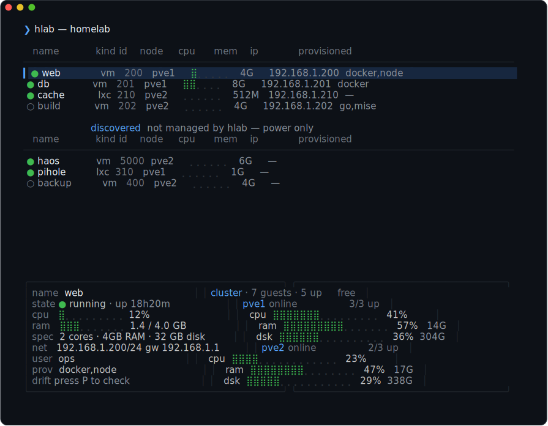

# hlab

**Create and manage Proxmox VMs and LXC containers, quickly and simply.** Think
*"I want a new server"* — not *"I want to configure Terraform"*.

hlab **discovers** your infrastructure through the Proxmox API, asks only what it
can't infer, and drives the official tools for you — **Terraform** for the guest
lifecycle and **Ansible** for provisioning. You never write or maintain Terraform
or Ansible by hand. It's both a **CLI** and a full-screen **dashboard TUI**.

Run `hlab` with no arguments for the dashboard: a live view of your VMs and
containers where create / provision / ssh / snapshot / destroy all happen inside the
app. The `hlab vm …` and `hlab ct …` subcommands remain for scripting.

**Site: [hlab.sh](https://hlab.sh)**





## Features

- **Create & manage VMs and LXC containers** from simple, versioned declarations.
- **Dashboard TUI** — live status, cluster metrics, and every operation in one app.
- **Discovers your cluster** via the Proxmox API; asks only what it can't infer.
- **Orchestrates Terraform + Ansible** under the hood — no hand-written config.
- **Day-2 operations** — snapshots, migrate between nodes, resize CPU/RAM/disk.
- **Adopt existing guests** created outside hlab, without ever touching them.
- **Provisioning** — a software catalog (Docker, Podman, k3s, language runtimes,
  agents) plus your dotfiles, installed idempotently.
- **Themeable** — built-in themes with live switching, plus your own.

## Requirements

- A **Proxmox VE cluster** (tested on Proxmox 9).
- A scoped **API token** — see [docs/proxmox-token.md](docs/proxmox-token.md).
- **Terraform** and **Ansible** — the installer sets these up for you (Ansible is
  only needed for `provision`).

## Install

### Homebrew (macOS / Linux)

```bash
brew install aikssen/tap/hlab
```

Installs and updates the release binary via the `aikssen/tap` tap (verified against
the release's `SHA256SUMS`).

### curl | bash

The one-liner installs the latest release binary to `~/.local/bin` (idempotent —
re-run to update; the download is verified against the release's `SHA256SUMS`):

```bash
curl -fsSL https://raw.githubusercontent.com/aikssen/hlab/main/scripts/install.sh | bash
```

Or build from a local checkout:

```bash
./scripts/install.sh    # build + install hlab to ~/.local/bin  (or: mise run install)
hlab version
```

**The installer also installs hlab's runtime tools** after hlab itself, picking the
right build for your OS/arch: **Terraform** (pinned to a known-good version,
overridable with `HLAB_TERRAFORM_VERSION`) and **Ansible** (best-effort via pipx →
Homebrew → system package manager → pip). An already-installed Terraform or Ansible
is detected and reused, and dependency installation is **non-fatal** — a tool that
can't be auto-installed only warns and never blocks the hlab binary. Set
`HLAB_SKIP_DEPS=1` to skip the dependency phase entirely. Other knobs:
`HLAB_BIN_DIR`, `HLAB_VERSION`, `HLAB_FROM_RELEASE=1`.

Ensure `~/.local/bin` is on your `PATH`.

> **macOS note:** if you download a binary manually (not via `curl | bash`),
> Gatekeeper quarantines it — clear it with
> `xattr -d com.apple.quarantine ./hlab`.

### Windows

Download `hlab_windows_amd64.exe` (or `hlab_windows_arm64.exe`) from the
[Releases](https://github.com/aikssen/hlab/releases) page, rename it to `hlab.exe`,
and put it on your `PATH`. hlab needs **`terraform`** and **`git`** on `PATH`; the
interactive `hlab vm ssh` uses the OpenSSH client bundled with Windows 10+.

> **Provisioning needs WSL:** `hlab vm provision` / `update` and `ct provision` drive
> **Ansible**, which has no native Windows build — run those inside WSL. Everything
> else (discovery, the dashboard, create/destroy, power, snapshots, migrate, adopt,
> drift/`plan`, resize) works natively. The `scripts/install.sh` installer is bash;
> on Windows download the `.exe` directly (or run the script under Git Bash/WSL).

## Quick start

```bash
hlab setup              # configure Proxmox connection + defaults (one time)
hlab doctor             # verify terraform + Proxmox connectivity
hlab                    # launch the dashboard TUI — manage everything here
```

Prefer the command line? The two-phase flow is:

```bash
hlab vm create --name web --vmid 200            # bring up the VM (Terraform)
hlab vm provision web --software docker,node     # install software (Ansible)
hlab vm ssh web
hlab vm destroy web
```

**Two phases, by design:** `create` brings up the guest (Terraform); `provision`
installs software and dotfiles (Ansible), where the selection is actually chosen and
persisted. The TUI drives the same two phases.

Containers work the same way under `hlab ct` (create from a container template):

```bash
hlab ct create --name cache --vmid 210 --template-file 'local:vztmpl/debian-12-…tar.zst' \
  --dhcp=false --ip 192.168.1.210/24 --plan small --password 's3cret'
```

See [docs/lxc.md](docs/lxc.md) for container specifics.

## How it fits together

hlab keeps everything it generates in a single home directory, **`~/.hlab`**
(override with `HLAB_HOME`). hlab creates it on first use, and you can version it
with git:

```
~/.hlab/
  config.yaml     Proxmox URL, API token, defaults, SSH keys, dotfiles repo, theme
                  — mode 0600, gitignored (holds a secret), never committed
  plans.yaml      VM + LXC size catalogs (user-editable; seeded on first use)
  vms/            per-guest declarations *.yaml — the versioned source of truth
  terraform/      generated workspace; tfvars versioned, *.tfstate/secrets gitignored
  ansible/        generated inventory + provisioning run data
```

> **Migrating from an older hlab?** Earlier versions split config across
> `~/.config/hlab` and `~/.hlab`. hlab now auto-migrates `config.yaml` /
> `plans.yaml` into `~/.hlab` on first run, printing a one-line notice. Nothing to
> do by hand.

## Commands

Every VM/container subcommand accepts a **name or a numeric ID**.

| Command | What it does |
|---------|--------------|
| `hlab` | Launch the dashboard TUI. |
| `hlab setup` | Configure connection/defaults (`--add-node`, `--add-ssh-key` to extend). |
| `hlab doctor` | Check terraform, Proxmox reachability, config. |
| `hlab plan [name\|id]` | Read-only drift report — never applies. |
| `hlab theme [name]` | List or switch [themes](docs/themes.md). |
| `hlab vm create` / `hlab ct create` | Create a VM / container (Terraform). |
| `hlab vm provision <id>` | Install software / dotfiles (Ansible). |
| `hlab vm list` · `show` · `ssh` | Inspect and connect. |
| `hlab vm start` · `stop` · `reboot` | Power control. |
| `hlab vm migrate` · `resize` | Move between nodes; change CPU/RAM/disk. |
| `hlab vm snapshot` · `snapshots` · `rollback` · `snapshot-delete` | Snapshots. |
| `hlab vm adopt <id>` | Bring an existing, unmanaged guest under hlab's control. |
| `hlab vm update <id>` | Re-provision idempotently (`--upgrade` also upgrades). |
| `hlab vm add-ssh-key <id>` | Add an SSH key to a running guest. |
| `hlab vm destroy <id>` | Destroy the guest and its declaration. |

`hlab ct …` mirrors these for LXC containers. For **every command, flag, and
default**, see the [full command reference](docs/commands.md).

## Documentation

- [hlab.sh](https://hlab.sh) — project site.
- [Command & flag reference](docs/commands.md) — every subcommand, flag, and adopt.
- [Proxmox API token](docs/proxmox-token.md) — least-privilege role setup.
- [LXC containers](docs/lxc.md) — templates, nesting, static IP, migration caveats.
- [SSH keys](docs/ssh-keys.md) — add-ssh-key and keyless-guest recovery.
- [Dotfiles](docs/dotfiles.md) — dotfiles as a catalog entry + SSH agent forwarding.
- [Themes](docs/themes.md) — built-in and custom themes.
- [Wizard design](docs/wizard.md)
- [Contributing](CONTRIBUTING.md) — build, test, and submit changes.

## Status

hlab is stable and in active use. Highlights so far: setup + Proxmox
discovery, the create wizard, Terraform create/destroy, Ansible provisioning (a
software catalog + dotfiles), a full-screen dashboard TUI, day-2 operations
(migrate / snapshots / resize), full LXC support, adopting existing guests, drift
detection, idempotent re-provisioning, and a cluster metrics panel.

For the current version see the [latest release](https://github.com/aikssen/hlab/releases/latest)
(or run `hlab version`); [CHANGELOG.md](CHANGELOG.md) tracks what changed.

Next up: provisioning profiles, state resilience, and backups (needs a NAS/PBS target).
